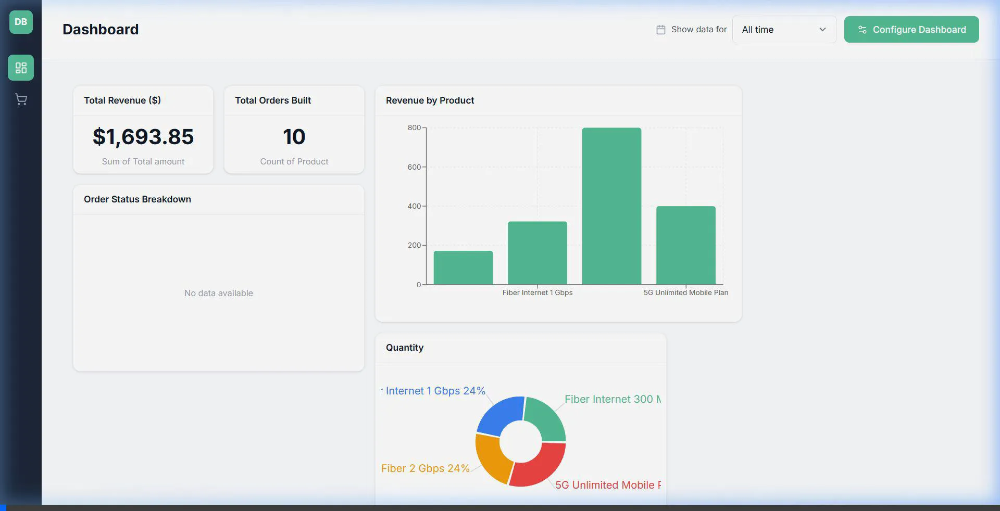
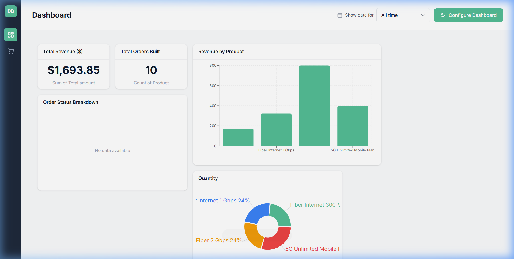
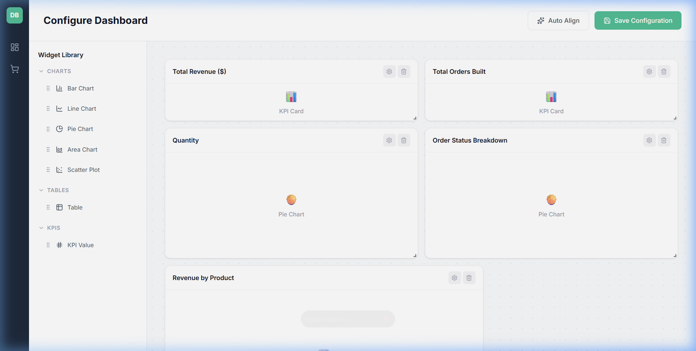
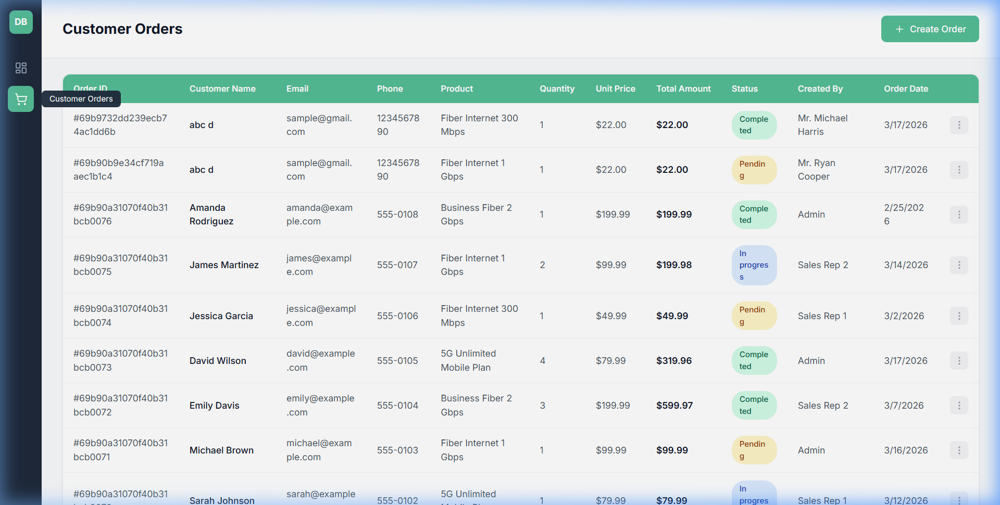

# Custom Dashboard Builder



A full-stack React application that allows users to build, configure, and save customized dashboards. Users can drag and drop various data widgets onto a grid canvas to visualize customer and order data.

## 📸 Previews

### Dashboard View


### Configure Dashboard


### Orders Page



## 🚀 Features

- **Draggable Grid Canvas**: Build your dashboard by dragging and resizing widgets using `react-grid-layout`.
- **Rich Widget Library**:
  - **KPI Cards**: Display aggregated metrics (Count, Sum, Average).
  - **Charts**: Visualize data with Bar, Line, Area, Pie, and Scatter charts powered by `recharts`.
  - **Data Tables**: View detailed records with sorting, filtering, and pagination.
- **Widget Configuration**: Customize each widget's data source, aggregation type, colors, and formatting.
- **Auto-Align**: Automatically organize your dashboard layout with the click of a button.
- **Persistent Layouts**: Dashboard configurations are saved to a MongoDB database so they persist across sessions.
- **Responsive Design**: The dashboard automatically adjusts its layout for different screen sizes (Large, Medium, Small).

## 🛠️ Tech Stack

**Frontend:**
- React 19
- Vite
- TailwindCSS 4
- React Router v7
- Recharts (Data visualization)
- React Grid Layout (Drag & drop grid)
- Lucide React (Icons)

**Backend:**
- Node.js & Express
- Prisma ORM
- MongoDB

## 💻 Getting Started

### Prerequisites
- Node.js (v18+)
- MongoDB running locally or a MongoDB Atlas URI

### Installation

1. **Clone the repository**

2. **Backend Setup**
   ```bash
   cd server
   npm install
   ```
   
   Create a `.env` file in the `server` directory and add your MongoDB connection string:
   ```env
   DATABASE_URL="mongodb://localhost:27017/dashboard_builder"
   ```

   Generate the Prisma client:
   ```bash
   npx prisma generate
   ```

   Start the backend server (runs on port 3001):
   ```bash
   npm run dev
   ```

3. **Frontend Setup**
   Open a new terminal window/tab:
   ```bash
   # From the project root
   npm install
   ```

   Start the Vite development server (runs on port 5173):
   ```bash
   npm run dev
   ```

4. **Open the Application**
   Navigate to `http://localhost:5173` in your browser.

## 📁 Project Structure

```
├── server/                 # Express backend
│   ├── prisma/             # Prisma schema
│   ├── src/
│   │   ├── routes/         # API routes (orders, dashboard)
│   │   └── index.js        # Server entry point
│   └── .env                # Database configuration
├── src/                    # React frontend
│   ├── components/         # Reusable UI components
│   │   ├── dashboard/      # Dashboard-specific components (Grid, Config, Sidebar)
│   │   └── widgets/        # Widget implementations (KPI, Charts, Table)
│   ├── pages/              # Application pages (Dashboard, Config, Orders)
│   ├── services/           # Axios API client
│   ├── App.jsx             # Main application layout and routing
│   └── main.jsx            # React entry point
└── index.css               # Global styles and Tailwind imports
```

## 📝 License

This project is open-source and available under the MIT License.
